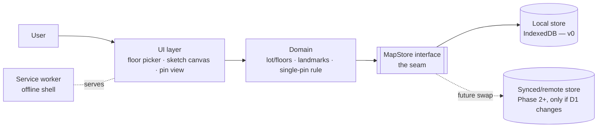

# Design Doc (TRD) — ParkHere · "내 차 어디 세웠지?" 기록 앱

**Status:** Implemented (v0 prototype live)  ·  **Author (owner):** <you> · **Reviewers:** <mentor> ·
**Related:** PRD → `PRD-parking-spot.md` · ADR decisions recorded inline in §6 ·
**Last updated:** 2026-07-25

---

## 1. Context & Summary
Implements `PRD-parking-spot.md`. A **single-user, offline-first PWA** (iPhone Safari,
installed to the home screen) for one regular **multi-floor** parking lot: per-floor
hand-drawn sketch maps with **fixed landmarks** (incl. the two entrances), and **one movable
car pin** placed in ≤ 2 touches (pick floor → tap spot).

Shape of the solution: **no server at all.** The whole app is a static PWA; all state lives
on the device. UI (floor picker, sketch canvas, pin view) talks to domain logic (lot / floors
/ the single-pin rule), which talks to **one storage interface**.

**The key seam → `MapStore`** (named in PRD §6). Everything above it reads/writes lot, floor
maps, landmarks, and the car pin through one small interface. The first implementation is
device-local browser storage; if D1 ever changes (multi-device, sharing, backup), we swap in
a synced/remote store **without touching drawing, floor, or pin logic**.

## 2. Goals & Non-Goals
**Design goals**
- Open (from home screen) → floor → tap → saved, in a few seconds, **fully offline**
  (underground lot = no signal; PRD §4 guardrail, §6 Must).
- Exactly **one** car pin app-wide, enforced in domain logic — placing a pin on any floor
  removes it from every other floor.
- Isolate all persistence behind `MapStore` so local-only (D1) is a swappable choice,
  not load-bearing architecture.
- Survive close/reopen: pin + maps persist across app restarts (PRD §6 acceptance).

**Design non-goals (this doc)**
- Any backend, account, or sync (PRD §5 — out of scope / D1).
- Automatic location detection (PRD §5).
- Multiple lots (PRD §5 Phase 2) — but the data model must not hard-code "one lot" so badly
  that Phase 2 means a rewrite (see §4).
- Native iOS app (PRD §6 — platform is PWA, D7).

## 3. Architecture

- **UI layer** — three surfaces: ① map editor (draw floor sketch + place landmarks, done
  once), ② marking flow (floor picker → tap = pin placed, the ≤2-touch hot path), ③ recall
  view (floor + pin + landmarks + "placed at" time). Stateless; renders what domain gives it.
- **Domain** — owns the invariants: one lot; a lot is an ordered set of floor maps; landmarks
  are fixed per floor; **exactly one car pin globally** (with `placedAt` timestamp, optional
  note). No storage details here.
- **★ The seam — `MapStore`** — the only thing that knows *where* data lives. v0 backing:
  browser local storage (engine choice → ADR, see §6). Contract sketched in §4.
- **Service worker + manifest** — makes it a PWA: home-screen install, app shell cached for
  offline launch. No network calls to intercept beyond the shell itself.

**Stack (DECIDED 2026-07-25 — built in `index.html`, single self-contained file):**
- **App:** static single-page web app in **vanilla JS** — 3 screens (home / edit / use), no
  framework, no build step. Two separate entry screens from a home menu (edit vs. use), so
  the marking hot path is never cluttered by editing tools.
- **Drawing = tile-grid isometric builder, NOT freehand strokes.** The user paints a grid of
  typed tiles (spot / lane / green / pillar / entrance / ramp) on a 3D-look isometric canvas.
  Chosen over freehand because: renders as a clean 3D map (reference: `123.png`), far easier
  to author on a phone, and storage becomes a tiny int grid instead of stroke lists.
  Editing UX: drag paints a translucent preview → release commits, Esc cancels, Ctrl+Z
  undo (50 steps), fill-floor-with-tool bulk action, resizable grid (6–48 × 6–36) with a
  9-way anchor choice for which side grows/crops.
- **Storage engine behind the seam:** **`localStorage`** (JSON blob, key `parkhere-v1`).
  The IndexedDB concern (drawing size) vanished with the tile-grid decision — a whole lot is
  a few KB. Swappable later via `MapStore` as designed.
- **Offline/PWA:** web app manifest + `sw.js` service worker (cache-first app shell) +
  apple-touch-icon. Registered only on https.

## 4. Data & API Design
- **Data model (AS BUILT, persisted via the seam as one JSON blob):**
  - `State { cols, rows, floors: [Floor], pin: CarPin | null }` — grid size is user-settable
    and stored; one implicit lot (Phase 2 "second lot" would wrap this in a Lot entity).
  - `Floor { id, label /* "B1" */, grid: int[rows][cols] }` — the map IS the tile grid.
  - **Tile enum:** `0 asphalt · 1/8/9/10 spot(N/E/S/W wheel-stopper side) · 2 lane ·
    3 green · 4 pillar · 5 entrance · 6 ramp · 7 pillar-with-entrance-sign`.
    Landmarks are tile types, not separate entities; spot orientation (car-stopper edge,
    rotated by tapping with the spot tool) is encoded in the tile value itself.
  - `CarPin { floorId, x, y, note?, placedAt }` — **stored as a singleton**, not per-floor:
    the schema itself makes "two pins on two floors" unrepresentable. `x,y` are grid cells
    (grid resize shifts them along with the chosen anchor; cropped-away pin is cleared).
  - **Wayfinding (D2, in-app not persisted):** BFS over walkable tiles from all entrances
    (nearest wins) or from a user-tapped entrance → red dotted route to the car.
- **API: no network API in v0.** The contract is the seam interface:
  - `MapStore.getLot() → Lot | null` · `saveLot(lot)`
  - `getFloor(floorId) → FloorMap` · `saveFloor(floorMap)` — covers create/edit/redraw
  - `getCarPin() → CarPin | null` · `setCarPin(pin)` — **replace semantics** (implements the
    single-pin rule at the storage boundary too) · `clearCarPin()`
  - All methods async (IndexedDB is async; also keeps the contract remote-ready).
  - **Phase 2+ swap:** a synced implementation adds sync/conflict concerns *behind* this same
    interface; callers unchanged. That is the whole point of the seam.
- **Error/edge contract (maps PRD §7):** `getLot() = null` → empty state (draw first);
  `getCarPin() = null` → "no spot marked"; `setCarPin` on a floor that was deleted/redrawn →
  reject in domain, prompt re-mark.

## 5. Non-Functional Requirements
<!-- skeleton — tighten numbers as W2–W3 reality arrives -->
- **Security/Privacy:** no accounts, no PII, no network writes; data never leaves the device.
  Serve over HTTPS (required for service worker anyway).
- **Performance:** home-screen tap → markable screen in ~1–2 s on iPhone; mark = ≤ 2 touches
  (PRD §4 guardrail). Canvas render of one floor sketch must feel instant.
- **Storage durability ★ top NFR risk:** iOS Safari **evicts site data after ~7 days of
  disuse** for non-installed sites; installed (home-screen) PWAs are exempt-ish but quota
  still applies. → Mitigations: require the install step in onboarding; request
  `navigator.storage.persist()`; **Should:** manual export/import (JSON) as backup. Verify on
  a real iPhone in W2 — this can kill the product silently.
- **Observability:** local-only → no telemetry. Keep a tiny in-app "last saved at" indicator
  so silent storage failures are visible (PRD §7 stale-pin display doubles as this).
- **Scale:** one user, one lot, a handful of floors — irrelevant by design; note only that
  drawing format keeps floors < ~100 KB each so quota is never a real constraint.
- **Failure mode:** storage read fails / evicted → app shows honest empty state + "restore
  from export" (if built), never a blank crash. Pin exists but its floor map fails to load →
  show floor label + note text as degraded fallback ("B2 · 램프 옆") — still beats nothing.

## 6. Alternatives Considered (all DECIDED 2026-07-25)
- **Storage engine:** ~~IndexedDB~~ → **localStorage chosen.** The tile-grid decision made
  maps tiny (KBs), removing the only reason to prefer IndexedDB. Behind `MapStore`, so
  reversible without touching callers.
- **Drawing representation:** ~~vector strokes~~ / ~~raster bitmap~~ → **typed tile grid on
  an isometric canvas renderer chosen.** Beats both: 3D look (user preference, `123.png`),
  phone-friendly authoring (paint cells, not draw lines), semantic tiles enable wayfinding
  (BFS needs to know what is road) — impossible with strokes or bitmaps.
- **App framework:** **vanilla JS chosen** — 3 screens, one canvas renderer, zero build.
- **Wayfinding start point:** fixed arrow (rejected in PRD grilling, D4) vs. nearest-entrance
  auto vs. user-selected → **both: nearest by default, tap an entrance to override.**
- **Settled by PRD (no ADR needed):** platform = PWA (D7) · storage locality = device-only
  (D1) · floors = first-class maps, not text (D5) · marks = landmarks + single pin (D4).

## 7. Risks & Dependencies
- **Risk — iOS data eviction** (see §5): the one failure that destroys all user value at once.
  Mitigate: install-to-home-screen onboarding + `persist()` + export. **Spike on a real
  device early (W2).**
- **Risk — drawing UX on a phone canvas:** if sketching a floor feels bad on a small
  touchscreen, the upfront-friction risk in PRD §9 gets worse. Mitigate: floor-duplicate
  template (PRD §9), test with the real lot rough-first.
- **Risk — iOS PWA quirks** (viewport, standalone mode, canvas touch events + scroll
  conflicts): budget a device-testing pass, don't trust desktop Safari.
- **Dependency:** static hosting with HTTPS (anything — GitHub Pages/Netlify) — needed only
  to install the PWA; after install the app runs offline.

## 8. Rollout / Phasing
- **DONE (2026-07-25, v0 built in one sprint):** MapStore + data model · isometric tile
  editor (preview-commit, Esc cancel, Ctrl+Z, fill-all, resizable grid w/ anchor) ·
  multi-floor with duplicate-as-template · single-pin rule + stale-pin timestamp + note ·
  wayfinding (nearest / selected entrance) · pillar entrance signs · car-stopper direction
  per spot · pinch-zoom & pan (mobile) + wheel zoom (desktop) · PWA (manifest, sw.js,
  icon) · **deployed to GitHub Pages**. Three style variants were prototyped
  (`version1-classic / version2-dark-neon / version3-pastel-toy`); **classic light chosen**
  as `index.html`.
- **NEXT:** install to iPhone home screen from the Pages URL → **real-iPhone
  storage/eviction spike (§5 top risk)** → draw the real lot → live in the real garage.
- **Go-live bar:** PRD §8 check passes **on a real iPhone, offline, in the real lot** —
  draw floors once, park, mark in ≤ 2 touches, close, reopen later, and walk straight to the
  car from either entrance. A desktop-browser pass does not count.
